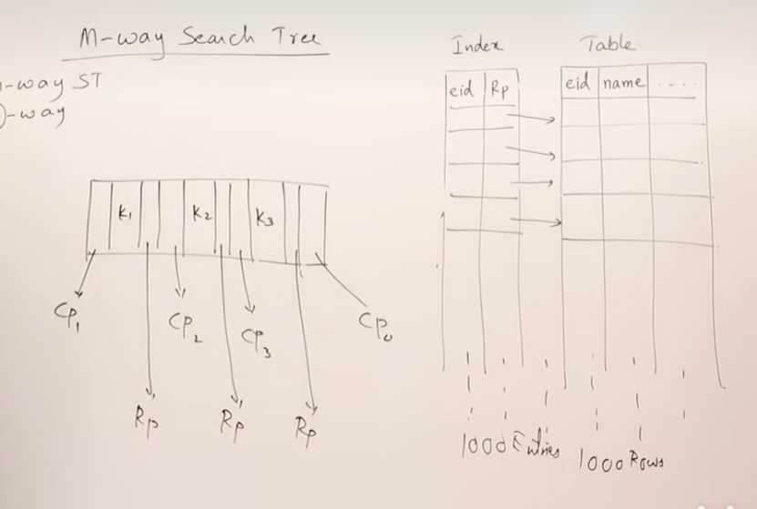
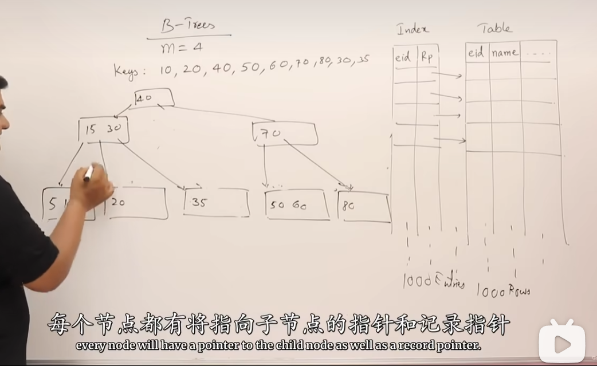
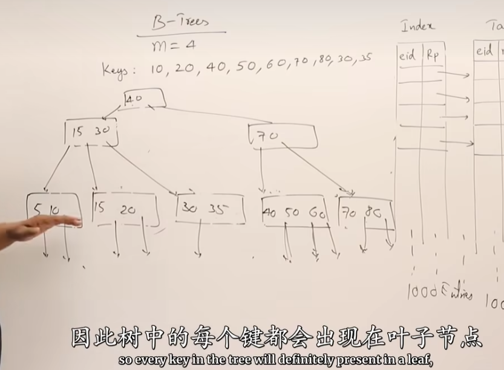
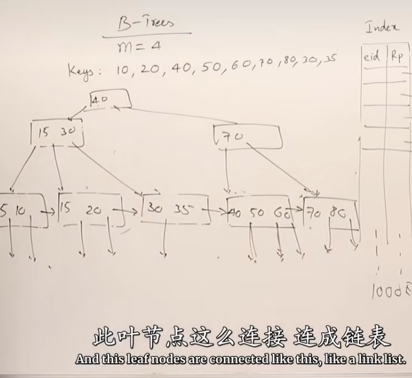

# 硬盘数据存储
硬盘数据分布是以轨道和扇区分成的小block为单位存储数据的，一般来说一个Block是512B

我们数据存储在硬盘上，我们需要把硬盘的数据放在主存中，程序才能读取数据。
按一定方法组织主存中的数据，能使使用效率更高效。

# 多层索引的必要性
## 当没有索引时查找数据
  

原始数据表每一行的数据量都很大，因此存储这个表需要较多的块，程序要一遍遍的扫描搜索这么多空间，效率低下。

## 索引的出现

**索引起作用的本质就是索引这个表每一行的数据量小** ，因此存储这个索引表需要的数据块很小，从而查询速度快。
索引表存储主键和指向存储原始表数据块的指针。

第一层索引时聚合索引，高层索引是稀疏索引
但是有引发了一个问题：**如果数据特别大，索引表也需要很大的空间存储呢？**  

## 多层索引的必要
- 因此，我们需要多层索引。

创造了指向存储索引块地址的索引。

这样的多层索引帮助我们大大提高的查询效率。

# B Tree and B+ Tree
## m叉树

实际上你会发现，多层索引就是一棵树

我们不想手动创建索引和手动创建多层索引，那么我们需要一个数据结构帮助我们做这种事。
m叉树，代表每一个节点有m个子节点，每一个节点最多m-1 个键。

### m叉树的插入
插入一个数据，如果这个节点键数满了，我们需要取中间的数往上移，其次剩余的分裂成两个子节点。

### m叉树的结构

不仅仅对于子节点有指向子节点的指针，同时对于每个键值对，有指向对应的数据库数据的指针。

## B Tree
### B Tree 创建的原因
当我们使用M叉树时，我们会发现它创建不受控制，导致可能会出现一条‘线性树’。查询效率可能会低下。
我们需要一个有约束的m叉树。
#### 具体约束条件：
- 每一个节点要想创建新节点，必须要保证所有节点都有m/2 个子节点。根节点除外
- 所有叶子节点在同一级别
- 创建过程从下自上
#### 重要点

没个键值都有指向数据库数据的指针。
**这样相当于实现了一个没有聚合索引的多层索引** 

## B+ Tree
### +体现在哪儿？
基本和B  Tree一样，但是**只有叶子节点有数据库的记录指针** ，每个键都会在叶子节点产生副本。

那么此时，这个**叶子节点们就是聚集索引**  ，这使得索引结构和我们之前涉想的完全一致。

### B Tree 和 B+ Tree 区别
B+ Tree 叶子节点必须有所有键值，非叶子节点没有记录指针。叶子节点形成链表，是我们想象的聚集索引

这也是为什么数据库索引选择B+ Tree的原因，多层索引时没有包含记录索引，因此多层索引时存储需要的Block很小，高层索引查询效率很快。导致全部查询都很快。 底层占用大没关系，高层就已经缩写的很小的范围了。